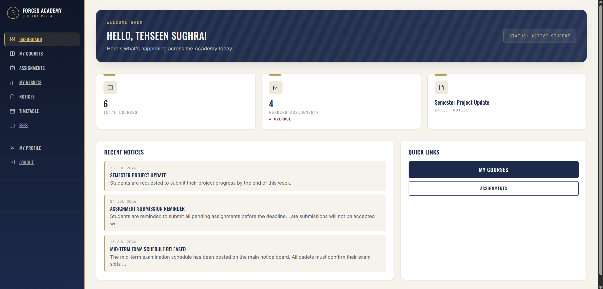
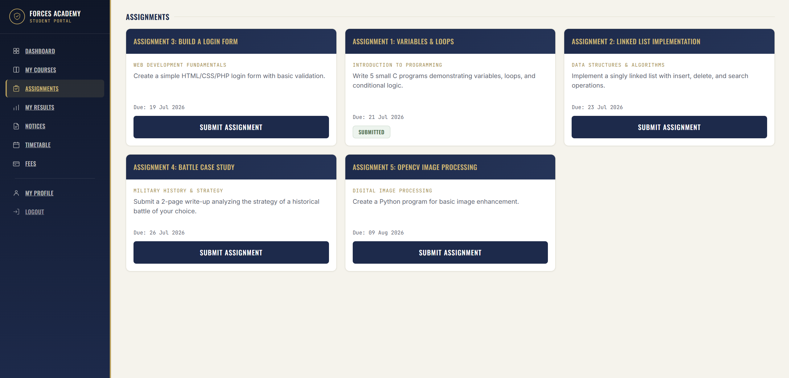
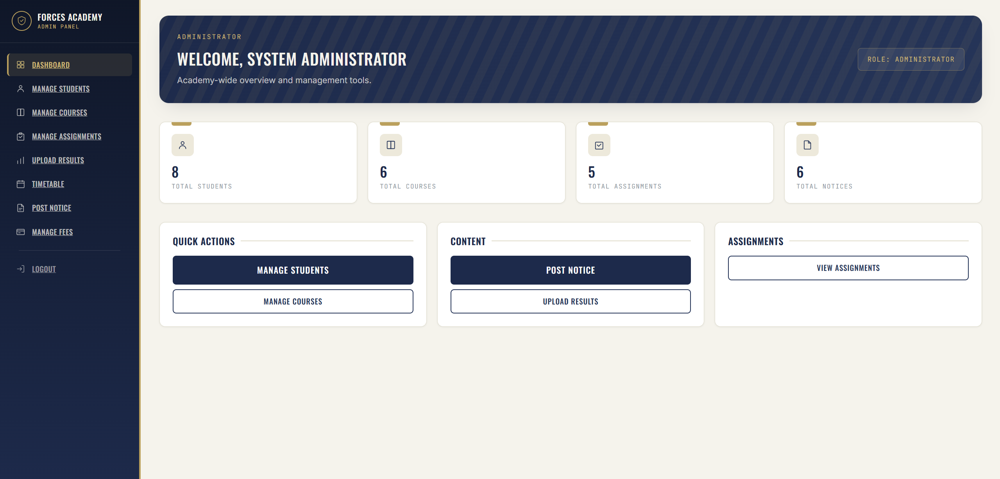
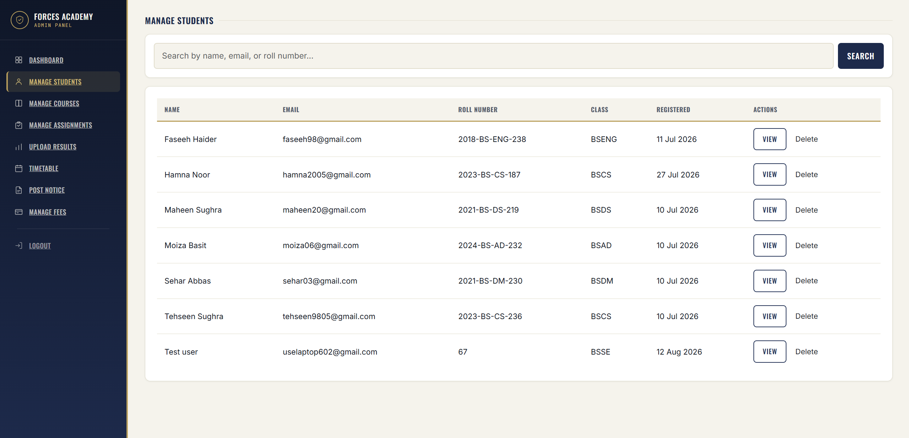
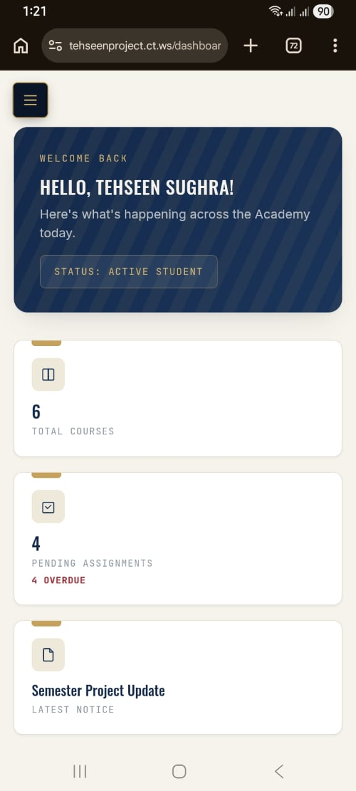

# Forces Academy LMS

A full-stack Learning Management System built for a military-academy-themed institution — students manage their courses, assignments, results, timetable, and fees, while admins run the entire academy through a dedicated control panel.

**Live Site:** [tehseenproject.ct.ws](https://tehseenproject.ct.ws)
**Admin Panel:** [tehseenproject.ct.ws/admin/login.php](https://tehseenproject.ct.ws/admin/login.php)

---

## Screenshots

| | |
|---|---|
|  |  |
|  |  |
|  | |

---

## Tech Stack

- **Backend:** PHP (procedural, mysqli with prepared statements)
- **Database:** MySQL
- **Frontend:** HTML5, custom CSS design system, Bootstrap 5
- **JavaScript:** Vanilla JS (no framework) — mobile navigation, password visibility toggle
- **Fonts:** Oswald, Inter, JetBrains Mono (Google Fonts)
- **Hosting:** InfinityFree (free PHP + MySQL hosting)
- **Version Control:** Git & GitHub

---

## Features

### Student Portal
- Secure registration and login with hashed passwords (`password_hash` / `password_verify`)
- Dashboard with live stats — total courses, pending assignments (with overdue flagging), and latest notice
- Course listing pulled directly from the database
- Notice board with title search
- Assignments page — view all assignments, submit files (PDF/image) with type and size validation, submitted status tracking
- Results page — view personal grades only, with a print-friendly "Print Results" view
- Weekly timetable filtered to the student's own class
- Fee records with total pending amount shown prominently
- Editable profile (name, email) and secure password change
- Fully responsive — off-canvas mobile navigation, tested on mobile, tablet, and desktop

### Admin Panel
- Completely separate login and session system from the student portal
- Dashboard with academy-wide stats (students, courses, assignments, notices)
- Manage Students — search by name, email, or roll number; view details; delete with confirmation
- Manage Courses — add, edit, delete
- Manage Assignments — add, edit, delete, linked to courses
- Post Notices — add and delete, instantly visible on the student side
- Upload Results — per student, per course, with subject/marks/grade/exam type
- Manage Timetable — add class schedules by day and time slot
- Manage Fees — add fee records per student, mark as paid, track overdue status

### Security & Validation
- All database queries use prepared statements (SQL injection protection)
- Passwords hashed, never stored in plain text
- Session-based access control on every protected page — unauthorized access redirects to login
- File uploads validated by both extension and real MIME type, saved with unique filenames
- Uploads folder protected with `.htaccess` to block script execution
- Server-side and client-side form validation (email format, password length)

---

## How to Run Locally

1. **Install a local PHP server** — [XAMPP](https://www.apachefriends.org/) (Windows/Mac/Linux) or [Laragon](https://laragon.org/) (Windows).

2. **Clone the repository:**
   ```bash
   git clone https://github.com/Tehseen20/forces-academy-fullstack-codesaviours-si26-tehseen.git
   ```
   Place the folder inside your server's web root (e.g. `htdocs/` for XAMPP).

3. **Create the database:**
   - Start Apache and MySQL from your XAMPP/Laragon control panel
   - Open phpMyAdmin (`http://localhost/phpmyadmin`)
   - Create a new database named `forces_academy_lms`
   - Open the SQL tab and run the full contents of `database/schema.sql` — this creates every table and inserts sample data in one go

4. **Configure the database connection:**
   Open `config/db.php` and set your local credentials:
   ```php
   $host     = "localhost";
   $user     = "root";
   $password = "";
   $database = "forces_academy_lms";
   ```

5. **Run the project:**
   Visit `http://localhost/forces-academy-lms/` in your browser. Register a new student account, or log in as admin using the sample credentials listed in `database/README.md`.

---

## Project Structure

```
forces-academy-lms/
│
├── index.php                  → Redirects visitors to login.php
├── login.php                  → Student login (with validation + password toggle)
├── register.php                → Student registration
├── logout.php                  → Destroys student session
│
├── dashboard.php               → Student dashboard — stats, recent notices, quick links
├── courses.php                 → List of all courses
├── notices.php                 → Notice board with search
├── assignments.php             → View assignments, submit files
├── upload_assignment.php       → Handles assignment file uploads (validation + storage)
├── results.php                 → Student's own results, with Print Results feature
├── timetable.php               → Weekly timetable filtered to the student's class
├── fees.php                    → Fee records + total pending amount
├── profile.php                 → Edit profile (name/email) + change password
│
├── config/
│   └── db.php                  → Single database connection used by every page
│
├── includes/                   → Shared code for student-facing pages
│   ├── auth.php                → Session check — redirects to login if not authenticated
│   └── sidebar.php              → Sidebar navigation (shared across all student pages)
│
├── admin/                      → Admin panel — completely separate login/session
│   ├── login.php                → Admin login
│   ├── logout.php               → Destroys admin session
│   ├── dashboard.php            → Admin dashboard — academy-wide stats
│   ├── students.php             → Manage students (search, view, delete)
│   ├── student_view.php         → View a single student's full details
│   ├── courses.php              → Manage courses (list + add)
│   ├── edit_course.php          → Edit an existing course
│   ├── assignments.php          → Manage assignments (list + add)
│   ├── edit_assignment.php      → Edit an existing assignment
│   ├── notices.php              → Post and delete notices
│   ├── results.php              → Upload results for students
│   ├── timetable.php            → Manage class timetables
│   ├── fees.php                 → Manage student fee records
│   │
│   ├── includes/
│   │   ├── auth.php             → Admin session check (separate from student auth)
│   │   └── sidebar.php           → Admin sidebar navigation
│   │
│   └── actions/                 → Backend handlers — no HTML, just logic + redirect
│       ├── save_course.php       (insert or update, based on hidden course_id)
│       ├── delete_course.php
│       ├── save_assignment.php
│       ├── delete_assignment.php
│       ├── save_notice.php
│       ├── delete_notice.php
│       ├── save_result.php
│       ├── save_timetable.php
│       ├── delete_timetable.php
│       ├── save_fee.php
│       ├── mark_fee_paid.php
│       ├── delete_fee.php
│       └── delete_student.php
│
├── css/
│   └── style.css                → Complete design system (colors, typography, all components)
│
├── js/
│   └── main.js                  → Mobile sidebar toggle + password show/hide
│
├── uploads/                     → Student-submitted assignment files (protected by .htaccess)
│   └── .htaccess                → Blocks script execution inside this folder
│
├── database/
│   ├── schema.sql               → Full database schema — all 9 tables + sample data
│   └── README.md                 → Setup instructions for the database
│
└── README.md                    → This file
```

### Why it's organized this way

- **Student pages live at the root**, admin pages live inside `/admin/` — this keeps the two user roles completely separate, both in the URL structure and in the codebase, matching how their sessions never overlap.
- **`admin/actions/` holds only logic, never HTML** — every file in there does one job (insert, update, or delete) and immediately redirects back to a list page. This separates "what the admin sees" from "what happens when they submit a form."
- **`includes/` vs `admin/includes/`** are deliberately separate, even though they serve a similar purpose, because the student and admin sidebars/auth checks are genuinely different — sharing one file between them would mean one wrong `if` statement could accidentally leak admin access to a student page.

---

## Built By

**Tehseen Sughra** | Code Saviours SI-26 | 2026
